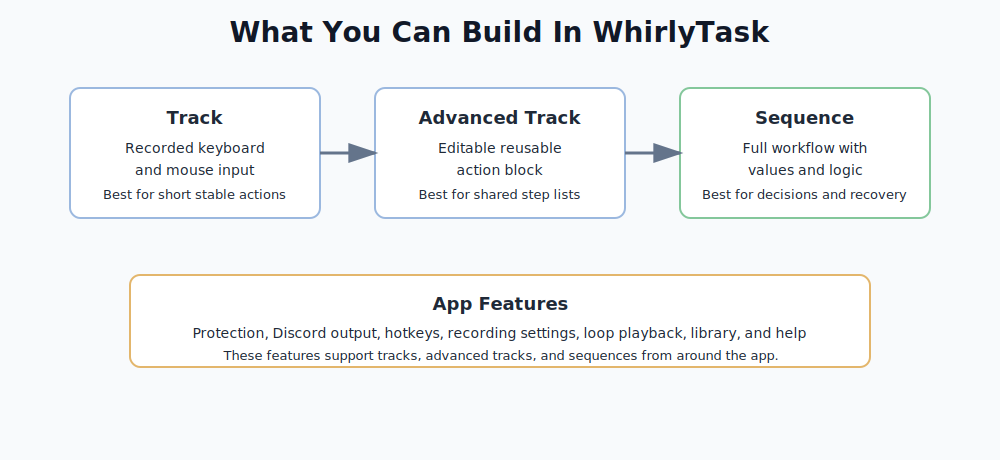

# Basics

This folder explains the main item types in WhirlyTask: tracks, advanced tracks, and sequences.

Before building anything large, learn this difference first. It prevents the most common mistake: trying to force a simple track to do logic, or building a huge sequence when a short reusable action would be enough.



## Item Types

| Item type | What it is | Best for | Open this |
| --- | --- | --- | --- |
| Track | Recorded keyboard and mouse input | Short actions that replay the same way | [Track](Track.md) |
| Advanced Track | Editable reusable step list | Reusable action blocks | [Advanced Track](Advanced-Track.md) |
| Sequence | Full workflow with values, conditions, and watchers | Logic, loops, reading, recovery, and messages | [Sequence](Sequence.md) |

## Quick Rule

Use the simplest item that can do the job.

| If you need... | Use |
| --- | --- |
| Replay a short recorded action | Track |
| Reuse a longer action block | Advanced Track |
| Read screen text, use values, branch, loop, or recover from problems | Sequence |
| Background checks while work is running | Sequence with watchers |

## How They Work Together

You can use more than one item type. Larger workflows often use all three:

```text
Track:
Small recorded input

Advanced Track:
Reusable step block

Sequence:
Main workflow that runs tracks, reads values, branches, loops, and handles problems
```

This makes the automation easier to fix. If a repeated action breaks, you can edit the track or advanced track without rebuilding the whole sequence.

## What Most People Should Start With

| Situation | Start with |
| --- | --- |
| You are testing WhirlyTask for the first time | A short track |
| You already know the workflow needs conditions or reading | A sequence |
| You have one repeated action used in many workflows | An advanced track |
| You are not sure yet | [Choosing What To Use](Choosing-What-To-Use.md) |

## Start Here

If you are not sure what to create, read [Choosing What To Use](Choosing-What-To-Use.md).

Also useful:

- [Getting Started](../Getting-Started.md)
- [Glossary](../Glossary.md)
- [Examples](../Examples/README.md)
