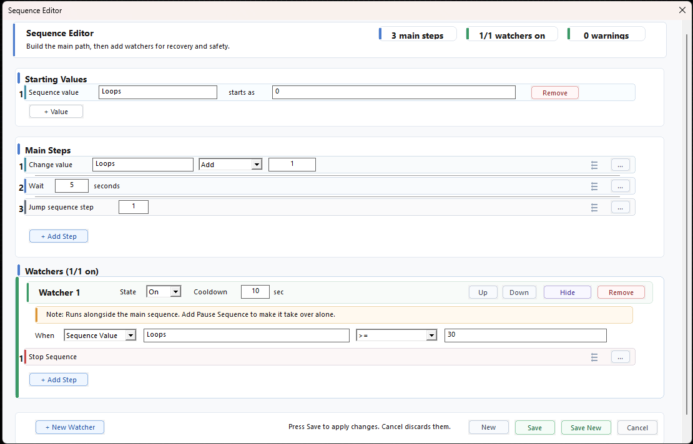

# Counter Limit

Use this pattern when a sequence should stop after too many loop runs.

This is useful for loops, repeated checks, and retry systems. The key idea is that the normal flow increases a counter, and another step or watcher stops the sequence when the counter reaches a limit.

There are two good ways to do it:

- Use an inline If Sequence Value step inside the loop.
- Use a watcher that watches the counter value.

The watcher version is often cleaner when the limit is a safety rule.

## Recommended: Watcher Safety Limit



Starting Values:

```text
Loops starts as 0
```

Main steps:

```text
1. Change Sequence Value Loops Add 1
2. Wait 5 seconds
3. Jump Sequence Step 1
```

Watcher trigger:

```text
When Sequence Value Loops >= 30
```

Watcher steps:

```text
1. Stop Sequence
```

This means the main sequence runs normally and adds `1` to `Loops` every time it repeats. When `Loops` reaches `30` or higher, the watcher stops the sequence.

Pause Sequence is optional here because the watcher only needs to stop playback. Add Pause Sequence first when the watcher needs to take over, do extra steps, and then continue or restart the main sequence.

## Why The Counter Is In The Main Steps

The main loop is the thing repeating, so the main loop should increase the counter.

The watcher only watches the result:

```text
Main steps:
Loops = Loops + 1

Watcher:
If Loops >= 30, stop
```

This keeps the safety rule separate from the normal repeated work.

## Why The Watcher Version Is Cleaner

The main sequence only handles the normal loop.

The watcher handles the safety rule.

This keeps the normal path easier to read and makes the limit harder to forget when the loop changes later.

## Simple Inline Version

Use this when the limit is part of the normal flow and you want everything in one place.

Starting Values:

```text
Loops starts as 0
```

Main steps:

```text
1. Change Sequence Value Loops Add 1
2. Wait 5 seconds
3. If Sequence Value Loops >= 30
   Then:
   1. Stop Sequence
   Else:
   1. Jump Sequence Step 1
```

## When To Use Each Version

| Version | Use when |
| --- | --- |
| Watcher safety limit | The counter is a guard that should stop the sequence whenever it gets too high |
| Inline limit | The counter check is part of the normal loop logic |

## Tips

- Use `>=` instead of `equals` so the limit still catches values that skip past the exact number.
- Use Jump Sequence Step when the counter should keep increasing, because Reset and Restart Sequence applies Starting Values again.
- Give watcher-based limits a reasonable cooldown to avoid repeated firing.

## More About

- Values and counters: [Values](../Values/README.md)
- Changing a counter: [Change Sequence Value](../Steps/Change-Sequence-Value.md)
- Watchers: [Watchers](../Watchers/README.md)
- Value watcher trigger: [When Sequence Value](../Watchers/Triggers/When-Sequence-Value.md)
- Stopping a sequence: [Stop Sequence](../Steps/Stop-Sequence.md)
- Building reliable loops: [Build A Reliable Sequence](../Guides/Build-A-Reliable-Sequence.md)
