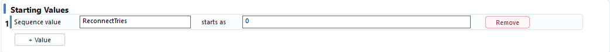
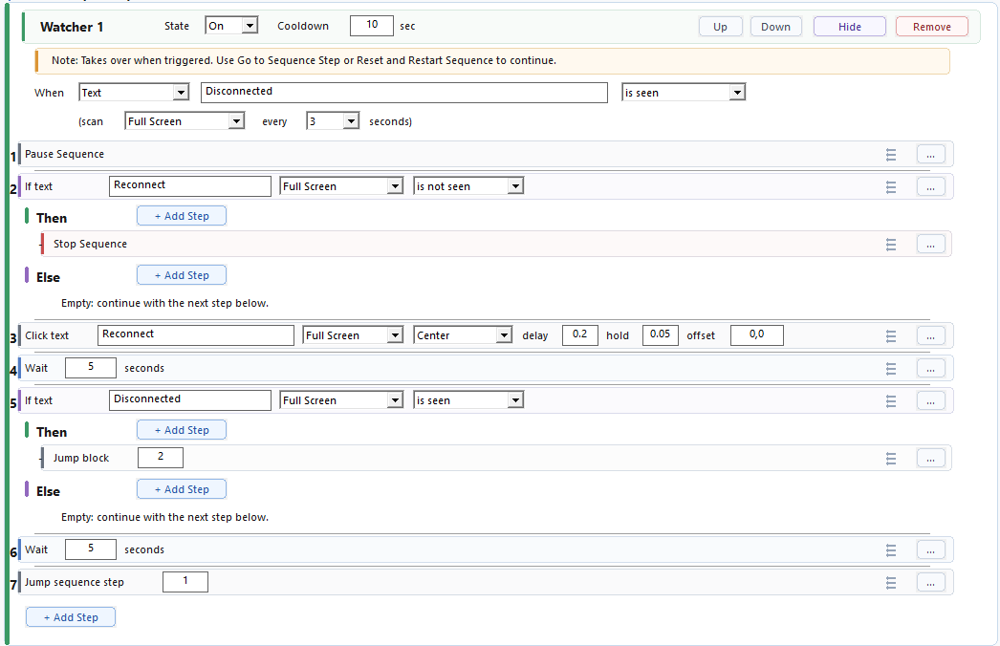

# Watcher Recovery

Use this pattern when something can interrupt the normal sequence and WhirlyTask should try recovery safely.

This page uses a reconnect recovery example. The same structure also works for warnings, dialogs, missing ready states, and other recoverable problems.

## The Basic Idea

Good watcher recovery usually has this shape:

```text
When a problem is seen:
1. Pause Sequence
2. Check whether the problem is still there
3. If retries are still allowed, try recovery
4. Check again
5. Continue, reset, or stop
```

The important part is that the watcher has a clear ending. It should not pause the sequence and then leave it stuck.

## Reconnect Recovery Example

Use it when:

- `Disconnected` appears on screen.
- `Reconnect` can be clicked to fix it.
- Reconnect may fail and need another attempt.
- The sequence should stop after too many failed reconnect attempts.

Starting value:



```text
ReconnectTries starts as 0
```

## Without A Retry Limit

This version can work, but it can loop forever if reconnect never succeeds.



Flow:

```text
When Disconnected is seen:
1. Pause Sequence
2. If Reconnect is not seen
   Then:
   1. Stop Sequence
3. Click Text Reconnect
4. Wait 5 seconds
5. If Disconnected is still seen
   Then:
   1. Jump Block Step 2
6. Wait 5 seconds
7. Jump Sequence Step 1
```

The risk is step 5. If `Disconnected` stays visible forever, the watcher keeps jumping back and trying again forever.

## With A Retry Limit

Add a counter check before clicking reconnect:


Recommended flow:

```text
When Disconnected is seen:
1. Pause Sequence
2. If Reconnect is not seen
   Then:
   1. Stop Sequence
3. If ReconnectTries >= 5
   Then:
   1. Stop Sequence
   Else:
   1. Change Sequence Value ReconnectTries Add 1
4. Click Text Reconnect
5. Wait 5 seconds
6. If Disconnected is still seen
   Then:
   1. Jump Block Step 2
7. Wait 5 seconds
8. Set Sequence Value ReconnectTries = 0
9. Jump Sequence Step 1
```

The screenshot shows the recommended retry-limit version, including resetting `ReconnectTries` to `0` after `Disconnected` is gone.

Resetting matters because a later disconnect should start fresh. If the value is already `5`, the watcher could stop immediately without trying reconnect for the new problem.

## Why This Works

- Pause Sequence stops the normal path while reconnect recovery runs.
- The watcher stops if the reconnect text is missing, because it has no safe recovery action.
- `ReconnectTries` prevents an endless retry loop.
- The watcher waits before checking again so the screen has time to update.
- Jump Block Step returns to the local reconnect checks instead of restarting the whole sequence.
- When disconnected is gone, the counter resets and the main sequence continues.

## Why Jump Block Step Goes To 2

Jump Block Step 2 returns to the reconnect check inside the watcher.

That means each retry still checks:

1. Is `Reconnect` visible?
2. Has the retry limit been reached?
3. Should it click reconnect again?

This is safer than jumping straight back to the click step.

## Why It Checks Disconnected Again

The watcher trigger only proves that `Disconnected` was seen once.

After clicking reconnect, the watcher waits and checks whether `Disconnected` is still visible:

| If `Disconnected` is still visible | If `Disconnected` is gone |
| --- | --- |
| Jump back and try again | Reset `ReconnectTries` and continue the main sequence |

This prevents the watcher from returning to the main sequence before recovery actually worked.

## Troubleshooting

| Problem | What to try |
| --- | --- |
| Later reconnects stop too early | Reset the reconnect counter after reconnect succeeds |
| The watcher checks again too soon | Wait long enough for the screen to update before jumping back |
| Retry limits behave strangely | Increase the retry value before recovery, then check the limit |
| The retry limit is reached but playback continues | Stop the sequence or send an alert in the limit branch |
| The watcher never fires | Make sure the trigger area includes the problem text |

## More About

- Watchers: [Watchers](../Watchers/README.md)
- Text watcher triggers: [When Text](../Watchers/Triggers/When-Text.md)
- Taking over from the main sequence: [Pause Sequence](../Watchers/Steps/Pause-Sequence.md)
- Continuing after recovery: [Jump Sequence Step](../Steps/Jump-Sequence-Step.md)
- Local watcher loops: [Jump Block Step](../Steps/Jump-Block-Step.md)
- Retry counters: [Change Sequence Value](../Steps/Change-Sequence-Value.md)
- Resetting counters: [Set Sequence Value](../Steps/Set-Sequence-Value.md)
- Watcher troubleshooting: [Watcher Troubleshooting](../Watchers/Troubleshooting.md)
- Full recovery guide: [Watcher Recovery Workflow](../Guides/Watcher-Recovery-Workflow.md)
