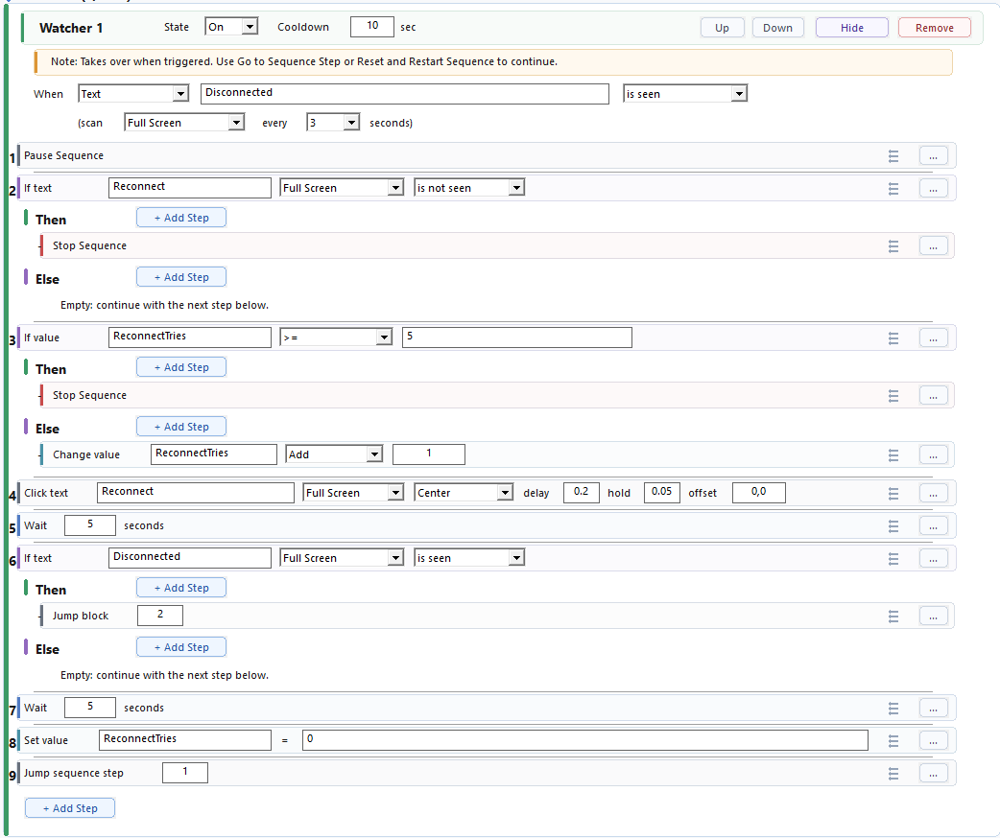

# Watcher Recovery Workflow

This guide explains how to build a watcher that handles an unexpected problem and then decides what happens next.

Use this when an error, warning, disconnected state, dialog, missing ready state, or other side event can appear while the main sequence is running.



## Basic Recovery Shape

```text
Watcher trigger:
When Text Problem is seen

Watcher steps:
1. Pause Sequence
2. Run recovery steps
3. Jump Sequence Step 2
```

Pause Sequence matters because it tells WhirlyTask that the watcher should take control. Without it, the main sequence can keep running while the watcher also runs.

## Setup From Scratch

1. Build the normal main steps first.
2. Create a watcher.
3. Choose the trigger that detects the problem.
4. Add Pause Sequence as the first watcher step if recovery should take over.
5. Add the recovery action, such as clicking a button, waiting, refocusing, or running an advanced track.
6. End with Jump Sequence Step, Reset and Restart Sequence, or Stop Sequence.
7. Test the watcher by creating the problem on purpose if possible.

## Choosing The Ending

| Ending | Use when |
| --- | --- |
| Jump Sequence Step | The workflow can continue from a known step |
| Reset and Restart Sequence | The workflow should return to a clean beginning and reset values |
| Stop Sequence | Continuing would be unsafe or pointless |

## Add A Retry Limit

If recovery can fail repeatedly, add a counter.

```text
Starting Values:
RecoveryTries starts as 0

Watcher:
When Text Problem is seen
1. Pause Sequence
2. Wait 5 seconds
3. If Text Problem is seen
   Then:
   1. If Sequence Value RecoveryTries < 5
      Then:
      1. Change Sequence Value RecoveryTries Add 1
      2. Run recovery steps
      3. Jump Block Step 2
      Else:
      1. Stop Sequence
4. Set Sequence Value RecoveryTries = 0
5. Jump Sequence Step 1
```

This checks whether the error is still there, tries recovery, counts attempts, and stops after too many failures.

Full reconnect recovery example: [Watcher Recovery](../Examples/Watcher-Recovery.md)

## Troubleshooting

| Problem | What to try |
| --- | --- |
| Main steps keep running during recovery | Add Pause Sequence near the start of the watcher |
| Recovery starts too late | Move Pause Sequence before watcher steps that change the app or values |
| The sequence stays paused | End recovery with Jump Sequence Step, Reset and Restart Sequence, or Stop Sequence |
| Later recovery stops too early | Reset retry counters after successful recovery |
| The watcher fires in harmless situations | Make the trigger more specific |

## More About

- [Watchers](../Watchers/README.md)
- [Watcher Triggers](../Watchers/Triggers/README.md)
- [Pause Sequence](../Steps/Pause-Sequence.md)
- [Counter Limit](../Examples/Counter-Limit.md)
- [Watcher Pauses And Never Continues](../Troubleshooting/Watcher-Pauses-And-Never-Continues.md)
