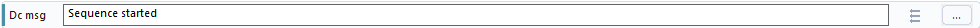

# Discord Message

Discord Message sends text to the Discord output configured in WhirlyTask.

Use it when you want the automation to report progress, results, warnings, or completed work outside the app.

## Before You Use It

Make sure Discord output is configured in WhirlyTask first. See [Discord Webhook](../App-Features/Discord-Webhook.md) for setup.

If Discord output is not set up, use [Status Message](Status-Message.md) temporarily so you can still see message text inside WhirlyTask.

## Fields

| Field | Meaning |
| --- | --- |
| Message | The text to send |

## What You Can Put In The Message

You can send plain text:



You can also include values:


When the step runs, WhirlyTask replaces `{ValueName}` with the current value. Replace `ValueName` with the real value name from Starting Values.

## Setup From Scratch

1. Create any values you want to use in Starting Values.
2. Fill those values with Set Sequence Value, Change Sequence Value, or Read Text.
3. Add Discord Message.
4. Write the message text.
5. Use `{ValueName}` inside the message if it should include a value.

## Example: Send Plain Text

```text
1. Discord Message Sequence started
```

Result in Discord:


## Useful For

- Completion messages.
- Error messages from watchers.
- Sending read screen text.
- Reporting attempt counts.
- Notifying you when a long sequence changes state.

## Troubleshooting

| Problem | What to try |
| --- | --- |
| A value is blank | Fill the value before this message step runs |
| `{ValueName}` appears literally | Check the value name and braces |
| Too many messages are sent | Increase watcher cooldown or move the message outside repeated steps |
| No Discord message appears | Set up [Discord Webhook](../App-Features/Discord-Webhook.md) first, then use Test Message |

## More About

- Full message workflow: [Messages And Values Workflow](../Guides/Messages-And-Values-Workflow.md)
- Discord setup: [Discord Webhook](../App-Features/Discord-Webhook.md)
- Complete notification example: [Notification System](../Examples/Notification-System.md)
- Values: [Values](../Values/README.md)
- Using `{ValueName}` in text boxes: [Using Values In Text Boxes](../Tips/Using-Values-In-Text-Boxes.md)
- Reading screen text into a value: [Read Text](Read-Text.md)
- Local messages inside WhirlyTask: [Status Message](Status-Message.md)
