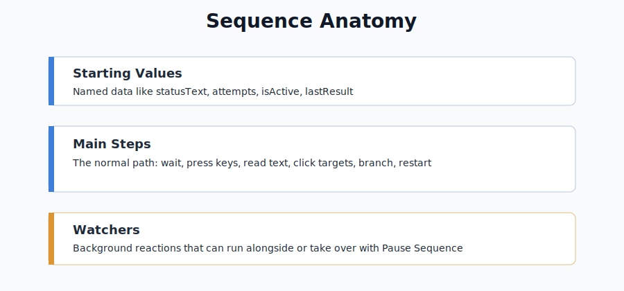

# Steps

This folder documents the actual steps shown in the WhirlyTask Add Step menu.

Each step has its own page. The groups below match the menu groups in the editor.

If you are not sure what a track, advanced track, or sequence is, start with [Basics](../Basics/README.md).

Most step pages explain:

- What the step does.
- What each field means.
- How to set it up from scratch.
- What it is useful for.
- Common mistakes.
- Related examples or troubleshooting pages.



## Find A Step By Goal

| I want to... | Step to check first |
| --- | --- |
| Replay a saved recording | [Play Track](Play-Track.md) |
| Run a reusable step block | [Run Advanced Track](Run-Advanced-Track.md) |
| Wait a fixed amount of time | [Wait](Wait.md) |
| Wait for text, images, windows, or internet state | [Wait For](Wait-For.md) |
| Click something visible | [Click Text](Click-Text.md) or [Click Image](Click-Image.md) |
| Read visible text into a value | [Read Text](Read-Text.md) |
| Save a screen image | [Take Screenshot](Take-Screenshot.md) |
| Press a keyboard key | [Press Key](Press-Key.md) |
| Move or click with the mouse | [Set Cursor Position](Set-Cursor-Position.md) or [Press Mouse Button](Press-Mouse-Button.md) |
| Check a condition and branch | [If Text](If-Text.md), [If Image](If-Image.md), [If Window](If-Window.md), [If Internet](If-Internet.md), or [If Sequence Value](If-Sequence-Value.md) |
| Store or change a value | [Set Sequence Value](Set-Sequence-Value.md) or [Change Sequence Value](Change-Sequence-Value.md) |
| Repeat a block a fixed number of times | [Repeat X Times](Repeat-X-Times.md) |
| Jump back or jump around | [Jump Sequence Step](Jump-Sequence-Step.md) or [Jump Block Step](Jump-Block-Step.md) |
| Let a watcher take over | [Pause Sequence](Pause-Sequence.md) |
| End playback | [Stop Sequence](Stop-Sequence.md) |
| Start the sequence over and reset values | [Reset and Restart Sequence](Reset-And-Restart-Sequence.md) |
| Send a message | [Status Message](Status-Message.md) or [Discord Message](Discord-Message.md) |
| Open, focus, fullscreen, or close something | [System steps](#system) |

## Step Categories

The step menu is split by purpose:

| Category | Purpose |
| --- | --- |
| Playback | Run saved items, wait, scan, read, or capture the screen |
| Input | Click, move the cursor, or press keys/buttons |
| Logic | Make decisions, repeat nested steps, and change values |
| Flow Control | Jump, pause, stop, return, or restart |
| System | Control windows, files, links, clipboard, and focus |
| Output | Show notes, status messages, or Discord messages |

## Playback

| Step | Open this |
| --- | --- |
| Play Track | [Play Track](Play-Track.md) |
| Run Advanced Track | [Run Advanced Track](Run-Advanced-Track.md) |
| Wait | [Wait](Wait.md) |
| Random Wait | [Random Wait](Random-Wait.md) |
| Wait For | [Wait For](Wait-For.md) |
| Read Text | [Read Text](Read-Text.md) |
| Take Screenshot | [Take Screenshot](Take-Screenshot.md) |

## Input

| Step | Open this |
| --- | --- |
| Click Image | [Click Image](Click-Image.md) |
| Click Text | [Click Text](Click-Text.md) |
| Press Key | [Press Key](Press-Key.md) |
| Set Cursor Position | [Set Cursor Position](Set-Cursor-Position.md) |
| Press Mouse Button | [Press Mouse Button](Press-Mouse-Button.md) |
| Scroll Wheel | [Scroll Wheel](Scroll-Wheel.md) |

## Logic

| Step | Open this |
| --- | --- |
| If Text | [If Text](If-Text.md) |
| If Image | [If Image](If-Image.md) |
| If Window | [If Window](If-Window.md) |
| If Internet | [If Internet](If-Internet.md) |
| If Sequence Value | [If Sequence Value](If-Sequence-Value.md) |
| For Chance | [For Chance](For-Chance.md) |
| Repeat X Times | [Repeat X Times](Repeat-X-Times.md) |
| Set Sequence Value | [Set Sequence Value](Set-Sequence-Value.md) |
| Change Sequence Value | [Change Sequence Value](Change-Sequence-Value.md) |

## Flow Control

| Step | Open this |
| --- | --- |
| Pause Sequence | [Pause Sequence](Pause-Sequence.md) |
| Stop Sequence | [Stop Sequence](Stop-Sequence.md) |
| Reset and Restart Sequence | [Reset and Restart Sequence](Reset-And-Restart-Sequence.md) |
| Return to Sequence | [Return to Sequence](Return-To-Sequence.md) |
| Jump Block Step | [Jump Block Step](Jump-Block-Step.md) |
| Jump Sequence Step | [Jump Sequence Step](Jump-Sequence-Step.md) |

Jump to Watcher Step is currently hidden from the Add Step menu. Its page remains for the parked watcher-specific jump behavior.

## System

| Step | Open this |
| --- | --- |
| Focus Window | [Focus Window](Focus-Window.md) |
| Fullscreen Window | [Fullscreen Window](Fullscreen-Window.md) |
| Set Clipboard | [Set Clipboard](Set-Clipboard.md) |
| Open App/File | [Open App/File](Open-App-File.md) |
| Open Link | [Open Link](Open-Link.md) |
| Close Window/App | [Close Window/App](Close-Window-App.md) |

## Output

| Step | Open this |
| --- | --- |
| Discord Message | [Discord Message](Discord-Message.md) |
| Status Message | [Status Message](Status-Message.md) |
| Note | [Note](Note.md) |

## Good Testing Pattern

When a step does not work, test it alone first:

```text
1. Status Message Starting test
2. The step you are testing
3. Status Message Finished test
4. Stop Sequence
```

For full patterns like loops, retries, watcher recovery, and notifications, see [Examples](../Examples/README.md).

## Related Pages

- [Getting Started](../Getting-Started.md)
- [Values](../Values/README.md)
- [Watchers](../Watchers/README.md)
- [Troubleshooting](../Troubleshooting/README.md)
