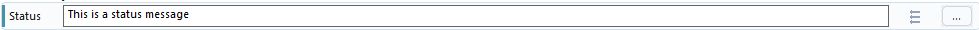
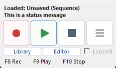

# Status Message

Status Message shows text inside WhirlyTask.

It is the best step for testing because it lets you see what the sequence is doing without sending anything outside the app.



When the step runs, the message appears in the main WhirlyTask window:



## Fields

| Field | Meaning |
| --- | --- |
| Message | The text to show |

## What You Can Put In The Message

Plain text:

```text
Starting sequence
```

Example:

```text
This is a status message
```

Text with values:

```text
Read text: {statusText}
Attempt {attempts}
```

## Setup From Scratch

1. Add Status Message before the step you are testing.
2. Add another Status Message after the step.
3. If testing a value, include `{ValueName}`.
4. Run the sequence and watch the WhirlyTask status.

## Example: Debug A Value

```text
1. Status Message About to read text
2. Read Text statusText from selected area
3. Status Message Read result: {statusText}
```

## Example: Show Branch Path

```text
If Sequence Value statusText contains Complete
Then:
1. Status Message Then branch ran
Else:
1. Status Message Else branch ran
```

## Useful For

- Testing Read Text.
- Checking which branch ran.
- Showing watcher triggers.
- Printing counters.
- Confirming that a step was reached.

## Troubleshooting

| Problem | What to try |
| --- | --- |
| Debugging becomes unclear | Keep simple Status Message steps until the sequence is stable |
| `{ValueName}` is blank | Check that the value exists, is spelled correctly, and was filled first |
| Discord messages are wrong | Test the text locally with Status Message before sending it to Discord |

## More About

- Notification example: [Notification System](../Examples/Notification-System.md)
- Discord messages: [Discord Message](Discord-Message.md)
- Values: [Values](../Values/README.md)
- Using values in text boxes: [Using Values In Text Boxes](../Tips/Using-Values-In-Text-Boxes.md)
- Testing tips: [Using Status Messages While Building](../Tips/Using-Status-Messages-While-Building.md)
