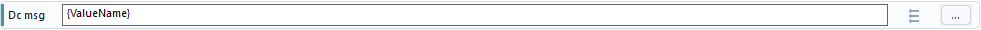
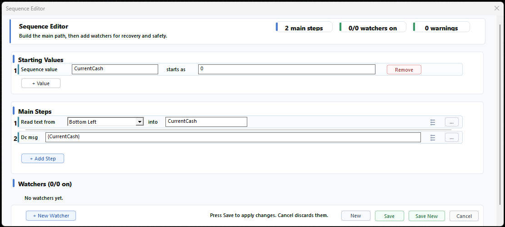

# Using Values In Text Boxes

You can use a value inside many WhirlyTask text boxes by writing the value name inside braces.

```text
{ValueName}
```

When the step runs, WhirlyTask replaces it with the current value.



## Example

If `statusText` contains:

```text
Ready
```

Then this text:

```text
Current status: {statusText}
```

becomes:

```text
Current status: Ready
```

## Useful Places

This is useful in text boxes that send, search, compare, copy, or open text.

Examples:

```text
Discord Message Current status: {statusText}
Status Message Current status: {statusText}
Set Clipboard Result: {resultText}
Click Text {buttonText}
Wait For (Text) {expectedText}
If Text {expectedText} is seen
Open Link {targetUrl}
```

If a value was filled by Read Text, the same placeholder works:



## Important Details

- The value should exist in Starting Values so it is visible and easy to reuse.
- The name must match exactly.
- Write placeholders without spaces inside the braces, like `{statusText}`.
- Dropdowns, buttons, and step number boxes are not normal text boxes.

## If It Shows Blank

Check that:

- The value exists.
- The value name is spelled correctly.
- A step filled the value before this step ran.
- Reset and Restart Sequence did not reset the value before this step ran.

## More About

- Values: [Values](../Values/README.md)
- Reading text into values: [Reading Text Into Values](../Values/Reading-Text-Into-Values.md)
- Blank value troubleshooting: [Value Is Blank](../Troubleshooting/Value-Is-Blank.md)
- Discord messages: [Discord Message](../Steps/Discord-Message.md)
