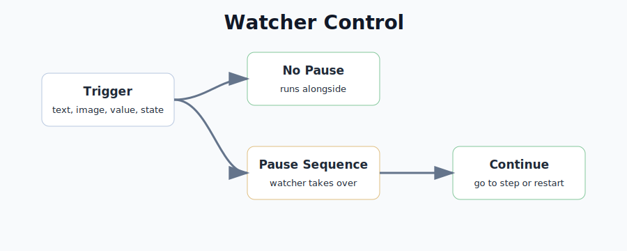

# Watchers

Watchers are background checks inside a sequence.



A normal sequence runs its main steps from top to bottom. A watcher runs beside those main steps and checks for a condition, such as text appearing, a value changing, an image being found, or a window opening.

You can think of a watcher like this:

```text
While the sequence runs:
  if this condition happens:
    run these watcher steps
```

Use watchers for side events, recovery, safety checks, and background reactions. Main steps should still handle the normal path.

Good structure:

```text
Main steps:
1. Do the normal workflow
2. Wait for the expected result
3. Continue

Watcher:
When a warning appears:
1. Handle the warning
2. Continue or stop
```

## When To Use A Watcher

Use a watcher when the condition can happen while other work is running.

| Situation | Watcher is a good fit? |
| --- | --- |
| An unexpected warning can appear at any time | Yes |
| A value can change while the main steps continue | Yes |
| A connection or window state can change during playback | Yes |
| The next normal expected step is to wait for text | Usually no, use main steps |
| The workflow should always check something before continuing | Usually no, use an If or Wait step |

## Start Here

| Page | What it explains |
| --- | --- |
| [Triggers](Triggers/README.md) | What makes a watcher fire |
| [Watcher Settings](Watcher-Settings.md) | State, scan interval, cooldown, and conflict behavior |
| [Pause Sequence](Steps/Pause-Sequence.md) | How a watcher can take over |
| [Examples](Examples.md) | Common watcher setups |
| [Watcher Troubleshooting](Troubleshooting.md) | What to check when watchers do not work |

## The Important Rule

By default, a watcher runs alongside the main sequence.

That means the watcher can do its own steps while the main sequence keeps running. This is useful for quick alerts, logs, notifications, or small fixes.

If you add a Pause Sequence step inside the watcher, the watcher takes control when it reaches that step. After that, use Jump Sequence Step, Reset and Restart Sequence, or Stop Sequence to decide what happens next.

If the watcher should take control immediately, put Pause Sequence as the first watcher step.

## Watcher Parts

| Part | Meaning |
| --- | --- |
| State | Whether the watcher is on or off |
| Scan interval | How often WhirlyTask checks the watcher condition |
| Cooldown | How long to wait before the watcher can fire again |
| Conflict | What happens if another watcher is already running |
| Trigger | The condition that makes it fire |
| Watcher steps | What it does after the trigger is true |

## Three Common Watcher Styles

| Style | What it does | Example ending |
| --- | --- | --- |
| Notify only | Sends a status or Discord message while main steps keep running | No pause needed |
| Take over and recover | Pauses the main sequence, fixes the problem, then continues | Jump Sequence Step |
| Stop or reset | Stops unsafe playback or starts from a clean beginning | Stop Sequence or Reset and Restart Sequence |

## Good Watcher Design

- Give each watcher one clear job.
- Choose a conflict mode that matches the watcher job.
- Use a cooldown long enough to avoid repeated firing.
- Put Pause Sequence early if the watcher should take over immediately.
- Use Status Message while testing so you can see when it fires.
- Keep recovery steps short and predictable.

## What Watchers Can Be Used For

- Reacting to something that can happen at an unexpected time.
- Closing or handling unexpected dialogs.
- Sending a message when text appears.
- Pausing the main sequence when an error appears.
- Reacting when a sequence value changes.
- Refocusing a window if the workflow loses focus.
- Stopping a sequence when a dangerous or unwanted state appears.

## Common Watcher Systems

| System | Open this |
| --- | --- |
| Handle unexpected warning | [Watcher Recovery](../Examples/Watcher-Recovery.md) |
| Continue after taking over | [Pause Sequence](Steps/Pause-Sequence.md) |
| Tune watcher behavior | [Watcher Settings](Watcher-Settings.md) |
| React to text | [When Text](Triggers/When-Text.md) |
| React to a value | [When Sequence Value](Triggers/When-Sequence-Value.md) |
| Fix watcher problems | [Watcher Troubleshooting](Troubleshooting.md) |

## Troubleshooting

| Problem | What to try |
| --- | --- |
| Main steps keep running during recovery | Add Pause Sequence near the start of the watcher |
| The sequence stays paused | End the watcher with Jump Sequence Step, Reset and Restart Sequence, or Stop Sequence |
| The watcher fires repeatedly | Increase the cooldown or make the trigger more specific |
| The watcher fires in the wrong situation | Use more specific trigger text, image, window, or area |
| The watcher handles the normal expected path | Move that logic into main steps |

## More About

- [Getting Started](../Getting-Started.md)
- [Triggers](Triggers/README.md)
- [Watcher Settings](Watcher-Settings.md)
- [Watcher Recovery](../Examples/Watcher-Recovery.md)
- [Watcher Does Not Fire](../Troubleshooting/Watcher-Does-Not-Fire.md)
